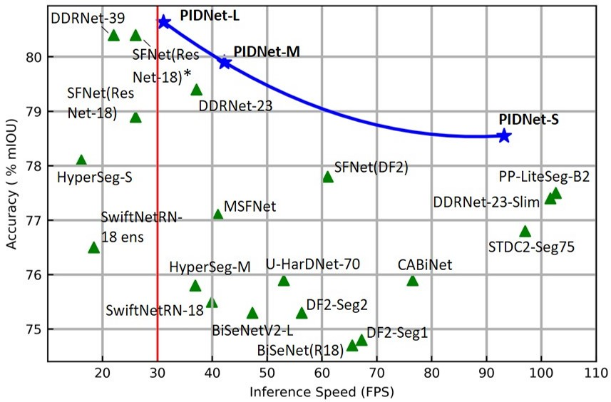
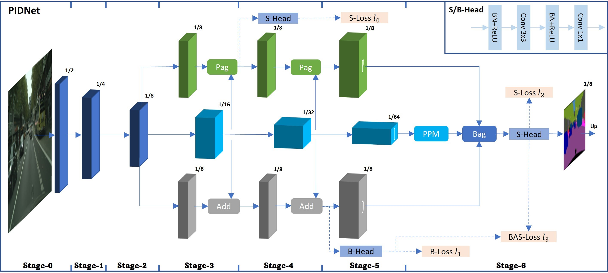
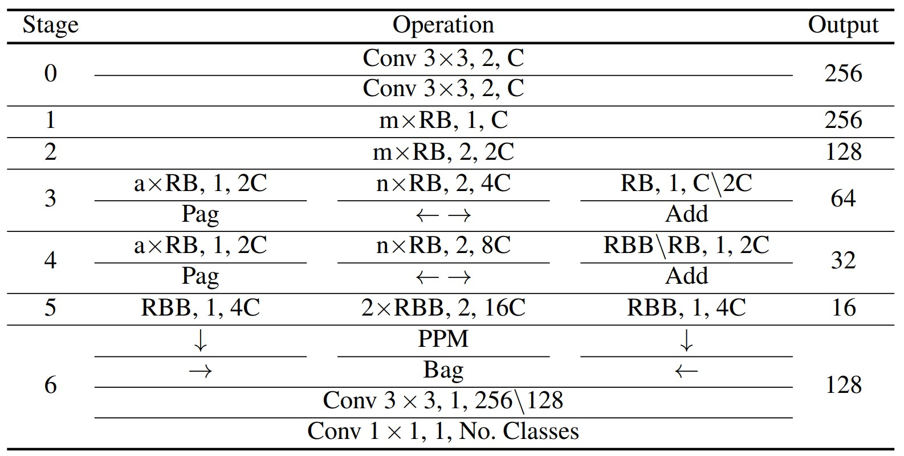

# PIDNet: A Real-time Semantic Segmentation Network Inspired from PID Controller
	
[](https://paperswithcode.com/sota/real-time-semantic-segmentation-on-camvid?p=pidnet-a-real-time-semantic-segmentation) [](https://paperswithcode.com/sota/real-time-semantic-segmentation-on-cityscapes?p=pidnet-a-real-time-semantic-segmentation)

[](https://paperswithcode.com/sota/real-time-semantic-segmentation-on-cityscapes-1?p=pidnet-a-real-time-semantic-segmentation) [](https://opensource.org/licenses/MIT)

This is the official repository for our recent work: PIDNet ([PDF](https://arxiv.org/pdf/2206.02066)）

## Highlights
<p align="center">
  </br>
  <span align="center">Comparison of inference speed and accuracy for real-time models on test set of Cityscapes.</span> 
</p>

* **Towards Real-time Applications**: PIDNet could be directly used for the real-time applications, such as autonomous vehicle and medical imaging.
* **A Novel Three-branch Network**: Addtional boundary branch is introduced to two-branch network to mimic the PID controller architecture and remedy the overshoot issue of previous models.
* **More Accurate and Faster**: PIDNet-S presents 78.6% mIOU with speed of 93.2 FPS on Cityscapes test set and 80.1% mIOU with speed of 153.7 FPS on CamVid test set. Also, PIDNet-L becomes the most accurate one (80.6% mIOU) among all the real-time networks for Cityscapes.

## Updates
   - This paper was accepted by CVPR 2023, new version and associated materials will be available soon! (Apr/06/2023)
   - Fixed the data bug for Camvid and the new version of arXiv preprint will be available on Jun 13th. (Jun/09/2022)
   - Our paper was marked as state of the art in [Papers with Code](https://paperswithcode.com/task/real-time-semantic-segmentation). (Jun/06/2022)
   - Our paper was submitted to arXiv for public access. (Jun/04/2022)
   - The training and testing codes and trained models for PIDNet are available here. (Jun/03/2022)

## Demos

A demo of the segmentation performance of our proposed PIDNets: Original video (left) and predictions of PIDNet-S (middle) and PIDNet-L (right)
<p align="center">
  </br>
  <span align="center">Cityscapes Stuttgart demo video #1</span>
</p>

<p align="center">
  </br>
  <span align="center">Cityscapes Stuttgart demo video #2</span>
</p>

## Overview
<p align="center">
  </br>
  <span align="center">An overview of the basic architecture of our proposed Proportional-Integral-Derivative Network (PIDNet). </span> 
</p>
P, I and D branches are responsiable for detail preservation, context embedding and boundary detection, respectively.

### Detailed Implementation
<p align="center">
  </br>
  <span align="center">Instantiation of the PIDNet for semantic segmentation. </span> 
</p>
For operation, "OP, N, C" means operation OP with stride of N and the No. output channel is C; Output: output size given input size of 1024; mxRB: m residual basic blocks; 2xRBB: 2 residual bottleneck blocks; OP<sub>1</sub>\OP<sub>2</sub>: OP<sub>1</sub> is used for PIDNet-L while OP<sub>1</sub> is applied in PIDNet-M and PIDNet-S. (m,n,C) are scheduled to be (2,3,32), (2,3,64) and (3,4,64) for PIDNet-S, PIDNet-M and PIDNet-L, respectively.

## Models
For simple reproduction, we provide the ImageNet pretrained models here.

| Model (ImageNet) | PIDNet-S | PIDNet-M | PIDNet-L |
|:-:|:-:|:-:|:-:|
| Link | [download](https://drive.google.com/file/d/1hIBp_8maRr60-B3PF0NVtaA6TYBvO4y-/view?usp=sharing) | [download](https://drive.google.com/file/d/1gB9RxYVbdwi9eO5lbT073q-vRoncpYT1/view?usp=sharing) | [download](https://drive.google.com/file/d/1Eg6BwEsnu3AkKLO8lrKsoZ8AOEb2KZHY/view?usp=sharing) |

Also, the finetuned models on Cityscapes and Camvid are available for direct application in road scene parsing.

| Model (Cityscapes) | Val (% mIOU) | Test (% mIOU)| FPS |
|:-:|:-:|:-:|:-:|
| PIDNet-S | [78.8](https://drive.google.com/file/d/1JakgBam_GrzyUMp-NbEVVBPEIXLSCssH/view?usp=sharing) | [78.6](https://drive.google.com/file/d/1VcF3NXLQvz2qE3LXttpxWQSdxTbATslO/view?usp=sharing) | 93.2 |
| PIDNet-M | [79.9](https://drive.google.com/file/d/1q0i4fVWmO7tpBKq_eOyIXe-mRf_hIS7q/view?usp=sharing) | [79.8](https://drive.google.com/file/d/1wxdFBzMmkF5XDGc_LkvCOFJ-lAdb8trT/view?usp=sharing) | 42.2 |
| PIDNet-L | [80.9](https://drive.google.com/file/d/1AR8LHC3613EKwG23JdApfTGsyOAcH0_L/view?usp=sharing) | [80.6](https://drive.google.com/file/d/1Ftij_vhcd62WEBqGdamZUcklBcdtB1f3/view?usp=sharing) | 31.1 |

| Model (CamVid) | Val (% mIOU) | Test (% mIOU)| FPS |
|:-:|:-:|:-:|:-:|
| PIDNet-S |-| [80.1](https://drive.google.com/file/d/1h3IaUpssCnTWHiPEUkv-VgFmj86FkY3J/view?usp=sharing) | 153.7 |
| PIDNet-M |-| [82.0](https://drive.google.com/file/d/1rNGTc8LD42h8G3HaedtqwS0un4_-gEbB/view?usp=sharing) | 85.6 |

## Prerequisites
This implementation is based on [HRNet-Semantic-Segmentation](https://github.com/HRNet/HRNet-Semantic-Segmentation). Please refer to their repository for installation and dataset preparation. The inference speed is tested on single RTX 3090 using the method introduced by [SwiftNet](https://arxiv.org/pdf/1903.08469.pdf). No third-party acceleration lib is used, so you can try [TensorRT](https://github.com/NVIDIA/TensorRT) or other approaches for faster speed.

## Usage

### 0. Prepare the dataset

* Download the [Cityscapes](https://www.cityscapes-dataset.com/) and [CamVid](http://mi.eng.cam.ac.uk/research/projects/VideoRec/CamVid/) datasets and unzip them in `data/cityscapes` and `data/camvid` dirs.
* Check if the paths contained in lists of `data/list` are correct for dataset images.

#### :smiley_cat: Instruction for preparation of CamVid data (remains discussion) :smiley_cat:

* Download the images and annotations from [Kaggle](https://www.kaggle.com/datasets/carlolepelaars/camvid), where the resolution of images is 960x720 (original);
* Unzip the data and put all the images and all the colored labels into `data/camvid/images/` and `data/camvid/labels`, respectively;
* Following the split of train, val and test sets used in [SegNet-Tutorial](https://github.com/alexgkendall/SegNet-Tutorial), we have generated the dataset lists in `data/list/camvid/`;
* Finished!!! (We have open an issue for everyone who's interested in CamVid to discuss where to download the data and if the split in [SegNet-Tutorial](https://github.com/alexgkendall/SegNet-Tutorial) is correct. BTW, do not directly use the split in [Kaggle](https://www.kaggle.com/datasets/carlolepelaars/camvid), which is wrong and will lead to unnormal high accuracy. We have revised the CamVid content in the paper and you will see the correct results after its announcement.)
### 1. Training

* Download the ImageNet pretrained models and put them into `pretrained_models/imagenet/` dir.
* For example, train the PIDNet-S on Cityscapes with batch size of 12 on 2 GPUs:
````bash
python tools/train.py --cfg configs/cityscapes/pidnet_small_cityscapes.yaml GPUS (0,1) TRAIN.BATCH_SIZE_PER_GPU 6
````
* Or train the PIDNet-L on Cityscapes using train and val sets simultaneously with batch size of 12 on 4 GPUs:
````bash
python tools/train.py --cfg configs/cityscapes/pidnet_large_cityscapes_trainval.yaml GPUS (0,1,2,3) TRAIN.BATCH_SIZE_PER_GPU 3
````

### 2. Evaluation

* Download the finetuned models for Cityscapes and CamVid and put them into `pretrained_models/cityscapes/` and `pretrained_models/camvid/` dirs, respectively.
* For example, evaluate the PIDNet-S on Cityscapes val set:
````bash
python tools/eval.py --cfg configs/cityscapes/pidnet_small_cityscapes.yaml \
                          TEST.MODEL_FILE pretrained_models/cityscapes/PIDNet_S_Cityscapes_val.pt
````
* Or, evaluate the PIDNet-M on CamVid test set:
````bash
python tools/eval.py --cfg configs/camvid/pidnet_medium_camvid.yaml \
                          TEST.MODEL_FILE pretrained_models/camvid/PIDNet_M_Camvid_Test.pt \
                          DATASET.TEST_SET list/camvid/test.lst
````
* Generate the testing results of PIDNet-L on Cityscapes test set:
````bash
python tools/eval.py --cfg configs/cityscapes/pidnet_large_cityscapes_trainval.yaml \
                          TEST.MODEL_FILE pretrained_models/cityscapes/PIDNet_L_Cityscapes_test.pt \
                          DATASET.TEST_SET list/cityscapes/test.lst
````

### 3. Speed Measurement

* Measure the inference speed of PIDNet-S for Cityscapes:
````bash
python models/speed/pidnet_speed.py --a 'pidnet-s' --c 19 --r 1024 2048
````
* Measure the inference speed of PIDNet-M for CamVid:
````bash
python models/speed/pidnet_speed.py --a 'pidnet-m' --c 11 --r 720 960
````

### 4. Custom Inputs

* Put all your images in `samples/` and then run the command below using Cityscapes pretrained PIDNet-L for image format of .png:
````bash
python tools/custom.py --a 'pidnet-l' --p '../pretrained_models/cityscapes/PIDNet_L_Cityscapes_test.pt' --t '.png'
````

## Citation

If you think this implementation is useful for your work, please cite our paper:
```
@misc{xu2022pidnet,
      title={PIDNet: A Real-time Semantic Segmentation Network Inspired from PID Controller}, 
      author={Jiacong Xu and Zixiang Xiong and Shankar P. Bhattacharyya},
      year={2022},
      eprint={2206.02066},
      archivePrefix={arXiv},
      primaryClass={cs.CV}
}
```

## Acknowledgement

* Our implementation is modified based on [HRNet-Semantic-Segmentation](https://github.com/HRNet/HRNet-Semantic-Segmentation).
* Latency measurement code is borrowed from the [DDRNet](https://github.com/ydhongHIT/DDRNet).
* Thanks for their nice contribution.

